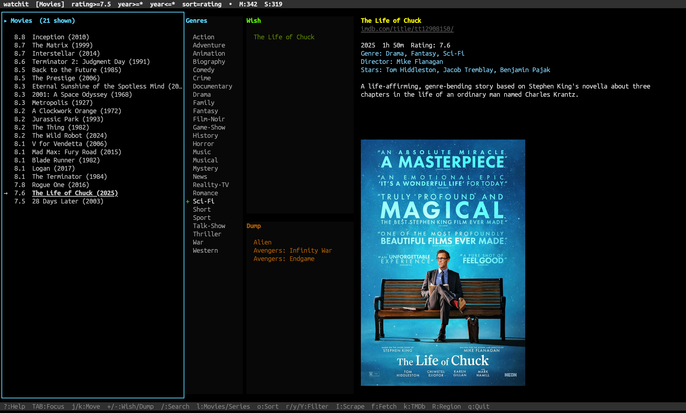

# Watchit - Terminal Movie & Series Browser


   [](https://github.com/isene/watchit/releases) [](https://github.com/isene/watchit/stargazers) 

A fast terminal browser for discovering and managing movies and TV series. Scrapes IMDb Top 250, tracks streaming availability via TMDb, keeps your own wish and dump lists, renders posters inline. Rust feature port of [IMDB-terminal](https://github.com/isene/IMDB), built on [crust](https://github.com/isene/crust) and [glow](https://github.com/isene/glow).

> *"Cut down the time spent searching in favor of time spent watching and cuddling."*

<br clear="left"/>

## Screenshot



*Movie browser with genre filter, wishlist/dump pane, and poster preview.*

## Install

```bash
# Prebuilt binaries (Linux x86_64/aarch64, macOS Intel/Apple Silicon):
# https://github.com/isene/watchit/releases

# Or build from source:
git clone https://github.com/isene/watchit
cd watchit
cargo build --release
./target/release/watchit
```

### Recommended companions

- **kitty**, **wezterm**, **foot**, or **iTerm2** for inline poster rendering (via glow)
- **ImageMagick** + **w3m-img** if your terminal only supports w3m-style images
- No Ruby, no node, no pip. One static binary.

## First Run

On first launch, watchit looks for existing data from the Ruby [IMDB-terminal](https://github.com/isene/IMDB) gem:

- `~/.imdb.yml` → config translated to `~/.watchit/config.yml`
- `~/.imdb/data/list.json`, `details.json`, all `tt*.jpg` posters → copied to `~/.watchit/data/`

So if you were already using IMDB-terminal, your Top 250, details, wish/dump lists, genre filters, TMDb key, and all 600+ cached posters arrive pre-populated.

If you're new, press **I** on first launch to scrape the IMDb Top 250 (takes about a minute in the background).

## Features

- **IMDb Top 250** for movies and series via embedded JSON-LD
- **Load additional lists** — popular movies/TV and trending (press `L`)
- **Per-title details**: plot, cast, directors, runtime, genres, release date, seasons/episodes for series
- **TMDb streaming info** — shows where each title is available in your region
- **Five panes**: list, genre filter, wish, dump, detail with poster
- **Focus-based borders** — the active pane highlights itself
- **Poster display** inline in the detail pane (kitty/sixel/w3m via glow)
- **Clickable IMDb links** (OSC 8) in every detail view
- **Genre filtering**: include (`+`), exclude (`-`), or clear (`Space`) on the highlighted genre
- **Rating / year filters**, sort by rating or alphabetical
- **Wish and dump lists** separate for movies and series
- **IMDb autocomplete search** (`/`) to add titles beyond the Top 250
- **Background threads** for scrape + fetch — UI never blocks
- **Verify (`v`)** — fetch missing details; **Refetch (`f`)** — re-pull current item
- **Duplicate removal (`D`)** across all lists

## Keys

| Key | Action |
|---|---|
| `TAB` / `S-TAB` | Cycle focus between list / genres / wish / dump |
| `UP` / `DOWN`, `j` / `k` | Move within focused pane |
| `PgUP` / `PgDOWN` | Page |
| `HOME` / `END` | First / last |
| `+` | Add to Wish (list) / Include genre (genres) |
| `-` | Dump (list) / Exclude genre / Remove (wish+dump) |
| `Space` | Clear genre filter on highlighted genre |
| `l` | Toggle Movies / Series view |
| `o` | Toggle sort (rating / alphabetical) |
| `r` | Set minimum rating |
| `y` / `Y` | Set min / max year |
| `/` | Search IMDb for new titles |
| `I` | Full scrape of Top 250 (background) |
| `i` | Incremental fetch of missing details |
| `f` | Re-fetch current item |
| `v` | Verify data integrity |
| `L` | Load popular + trending lists (background, no duplicates) |
| `D` | Remove duplicate entries |
| `k` | Set TMDb v3 API key |
| `R` | Set streaming region (ISO code) |
| `W` | Save config now |
| `?` / `q` | Help / Quit |

## Configuration

`~/.watchit/config.yml` (auto-created / auto-imported on first run):

```yaml
tmdb_key: ""
region: US
rating_min: 7.5
year_min: 0           # 0 = no filter
year_max: 0
sort: rating          # "rating" or "alpha"
view: movies          # "movies" or "series"
show_posters: true
movie_limit: 250
series_limit: 250
wish_movies: []
wish_series: []
dump_movies: []
dump_series: []
genres_include: []
genres_exclude: []
```

### TMDb streaming info (optional)

1. Sign up at [themoviedb.org](https://www.themoviedb.org)
2. Settings → API → Create → Developer; copy your v3 API key
3. Press `k` in watchit and paste the key
4. Press `R` to set your region (e.g. `US`, `GB`, `NO`)
5. Press `i` to refetch details; streaming providers appear in the detail pane

## File Layout

```
~/.watchit/
├── config.yml           # Your preferences
└── data/
    ├── list.json        # Movie + series metadata (title, rating, year, genres)
    ├── details.json     # Per-title details cache
    └── tt*.jpg          # Poster images
```

## Condition / Data Sources

- **Movies/series list**: IMDb Top 250 charts (`chart/top`, `chart/toptv`)
- **Additional lists**: IMDb popular charts (`moviemeter`, `tvmeter`) + trending
- **Per-title details**: IMDb title pages, parsed via embedded JSON-LD
- **Streaming availability**: [TMDb](https://www.themoviedb.org/) watch providers API

All scraping uses embedded structured data where possible (stable, parseable, no regex fragility).

## Part of the Rust Terminal Suite (Fe2O3)

See the [Fe₂O₃ suite overview](https://github.com/isene/fe2o3) and the [landing page](https://isene.org/fe2o3/) for the full list of projects.

- [rush](https://github.com/isene/rush) — shell
- [pointer](https://github.com/isene/pointer) — file manager
- [kastrup](https://github.com/isene/kastrup) — messaging hub
- [scroll](https://github.com/isene/scroll) — web browser
- [tock](https://github.com/isene/tock) — calendar
- [nova](https://github.com/isene/nova) — astronomy panel
- **watchit** — IMDb browser

All Fe2O3 tools share [crust](https://github.com/isene/crust) for the TUI and are installed as single static binaries. Fast startup, no runtime dependencies.

## License

Unlicense (public domain). Borrow or steal whatever you want.
